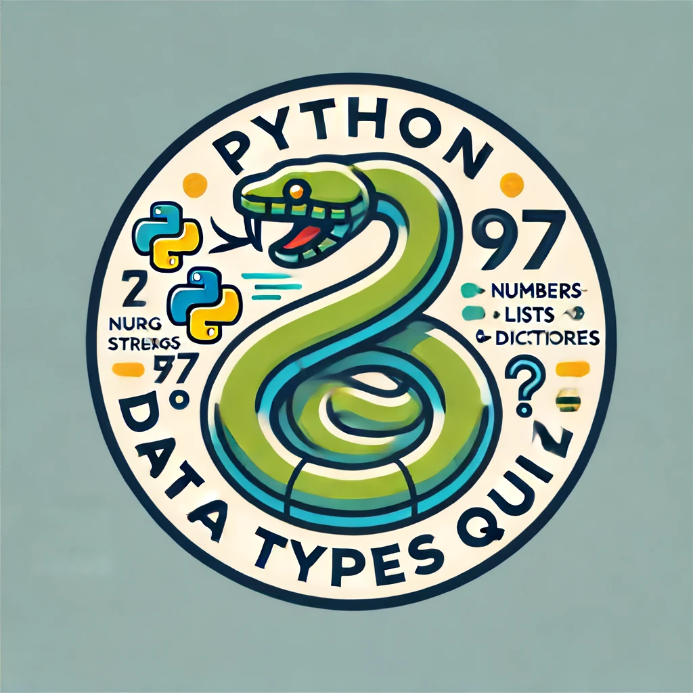
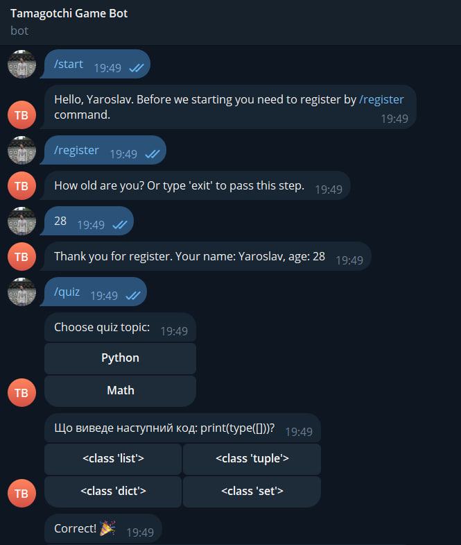

# Quiz Telegram Bot
> This project is a Telegram bot for conducting quizzes. It allows users to register, take quizzes on different topics, and track their performance. The bot stores user data (such as quiz scores and optional age) in a JSON file and can display individual results or a leaderboard of the top 5 players. Users can select quiz topics, answer multiple-choice questions, and receive immediate feedback on their answers. The bot supports registration, quiz participation, result checking, and leaderboard viewing through specific commands like /start, /quiz, /register, /my_results, and /leaderboard.


## Installing / Getting started

```shell
git clone https://github.com/yaroslav-demchenko/quiz-telegram-bot.git
cd quiz-telegram-bot/
python -m venv .venv
.venv\Scripts\activate.bat
pip install -r requirements.txt
export API_KEY=ENTER_YOUR_API_KEY_HERE
python quiz_bot.py run
```

## Example of working

